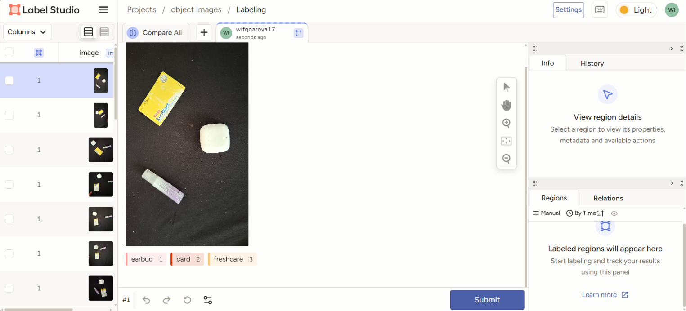
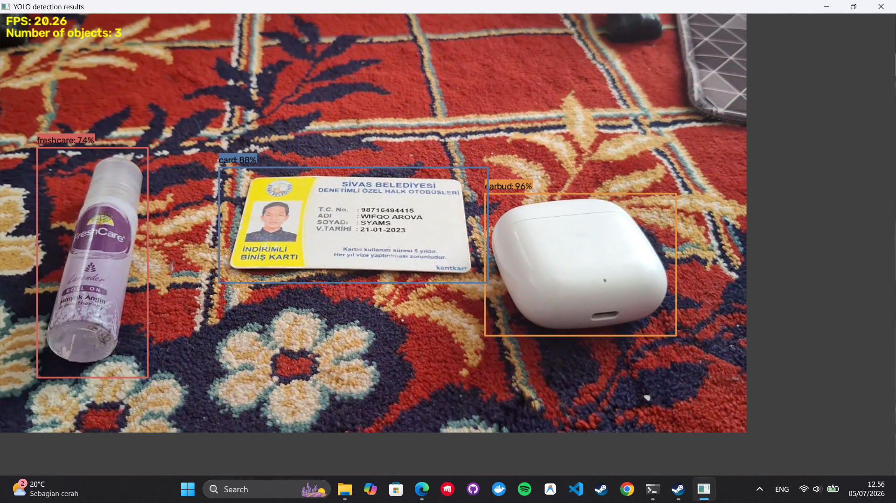

# Object Detection with YOLO26 — Earbud, Card & Bottle Detector

A simple end-to-end object detection project that trains a custom **YOLO26s** model to identify three everyday objects: **earbud**, **card**, and **bottle**. The pipeline covers dataset labeling, training on Google Colab, and real-time inference on a local machine using a USB webcam.

## Demo




## Overview

This project demonstrates a complete custom object detection workflow:

1. Collect and label image data using **Label Studio**
2. Train a **YOLO26s** model on **Google Colab**
3. Deploy and run the trained model locally for real-time detection via webcam

## Tech Stack

- **Model:** [Ultralytics YOLO26 (small variant)](https://docs.ultralytics.com/models/yolo26/)
- **Labeling tool:** [Label Studio](https://labelstud.io/)
- **Training environment:** Google Colab
- **Inference environment:** Local machine with CUDA-enabled GPU (optional but recommended)
- **Language:** Python 3.12

## Prerequisites

- [Anaconda](https://www.anaconda.com/) or [Miniconda](https://docs.conda.io/en/latest/miniconda.html)
- Python 3.12
- A webcam (for local inference)
- (Optional) NVIDIA GPU with CUDA support for faster inference

## Getting Started

### 1. Create a Conda Environment

```bash
conda create --name yolo-env1 python=3.12
conda activate yolo-env1
```

### 2. Label Your Dataset

Install [Label Studio](https://labelstud.io/) to annotate your images with bounding boxes for each class (`earbud`, `card`, `bottle`):

```bash
pip install label-studio
label-studio start
```

Use Label Studio's interface to draw bounding boxes and assign labels to your images.

Once labeling is complete, export the dataset in **YOLO format** (this produces images + `.txt` annotation files plus a `classes.txt`/`data.yaml`).

### 3. Train the Model on Google Colab

1. Upload your exported dataset to Google Colab (or Google Drive) and unzip it
2. Split the dataset into **train** and **validation** sets
3. Install Ultralytics:
```bash
   pip install ultralytics
```
4. Train the YOLO26s model:
```python
   from ultralytics import YOLO

   model = YOLO("yolo26s.pt")
   model.train(data="data.yaml", epochs=60, imgsz=640)
```
5. Validate results and retrain/tune hyperparameters until performance is satisfactory
6. Export and download the trained weights (`my_model.pt`)

> **Note:** Adjust `epochs`, `imgsz`, and other hyperparameters based on your dataset size and validation metrics.

### 4. Set Up Local Inference Environment

Install Ultralytics locally:

```bash
pip install ultralytics
```

Install PyTorch with CUDA support (check the [official PyTorch install matrix](https://pytorch.org/get-started/locally/) to confirm the correct CUDA index URL for your system/driver before running this):

```bash
pip3 install --upgrade torch torchvision --index-url https://download.pytorch.org/whl/cu121
```

> ⚠️ Verify your installed CUDA version (`nvidia-smi`) and match it against PyTorch's supported wheel index (e.g. `cu121`, `cu124`, `cu128`). Using an incorrect or non-existent CUDA tag will cause the install to fail.

### 5. Get the Inference Script

Place your trained `my_model.pt` inside a `my_model/` folder, then download the detection script:

```bash
curl -o yolo_detect.py https://raw.githubusercontent.com/EdjeElectronics/Train-and-Deploy-YOLO-Models/refs/heads/main/yolo_detect.py
```

### 6. Run the Model

```bash
python yolo_detect.py --model my_model.pt --source usb0 --resolution 1280x720
```

## Classes

| Class ID | Label   |
|----------|---------|
| 0        | Earbud  |
| 1        | Card    |
| 2        | Bottle  |

## Results

The trained YOLO26s model successfully detects and classifies all three target objects (earbud, card, bottle) in real time via webcam feed.


## Conclusion

This project demonstrates that a lightweight custom object detection pipeline — from manual labeling to a trained YOLO26s model — can reliably identify small everyday objects in real time on consumer hardware.

## Acknowledgements

- [Ultralytics YOLO26](https://docs.ultralytics.com/models/yolo26/)
- [Label Studio](https://labelstud.io/)
- Inference script adapted from [EdjeElectronics/Train-and-Deploy-YOLO-Models](https://github.com/EdjeElectronics/Train-and-Deploy-YOLO-Models)

## License

This project is open source. Add a license of your choice (e.g. MIT) if you plan to publish this publicly.
